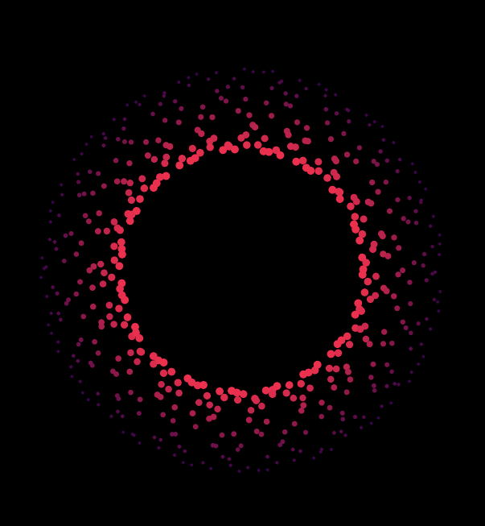

  
  <h1>Particircle</h1>
  
  <h3>A circle of particles </h3>

  <a href="https://particircle.netlify.app/"><h3>Try me!</h3></a>

  

  
  

## Technologies Used

&nbsp;&nbsp;&nbsp;&nbsp;&nbsp;&nbsp;

&nbsp;&nbsp;&nbsp;&nbsp;&nbsp;&nbsp;

&nbsp;&nbsp;&nbsp;&nbsp;&nbsp;&nbsp;

&nbsp;&nbsp;&nbsp;&nbsp;&nbsp;&nbsp;

## Description

An amount of smaller circles is created around a common center, forming a larger circles. The smaller circles, are then animated according to the sine trigonometric function, with the milliseconds passed used as a parameter. Their color and size is modified according to each circle's distance from the center. Their coordinated movement creates interesting patterns, resembling particles.

Double-click anywhere to enter fullscreen mode, double-click again (or press ESC) to leave fullscreen mode.

## Screenshots

## License

Copyright (c) 2022 Michael Kolesidis 
Licensed under the [MIT License](https://github.com/michaelkolesidis/particircle/blob/main/LICENSE).

 
 

[//]: # (Free Software)

   
   

  

                                                       

  

