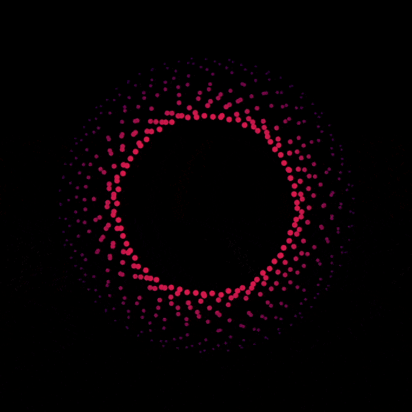

  
  <h1>particircle</h1>
  
  

  <h4>A circle of particles </h4>

  <h3><a href="https://particircle.netlify.app/">Visit</a></h3>

  
## Technologies Used

&nbsp;&nbsp;&nbsp;&nbsp;&nbsp;&nbsp;

&nbsp;&nbsp;&nbsp;&nbsp;&nbsp;&nbsp;

&nbsp;&nbsp;&nbsp;&nbsp;&nbsp;&nbsp;

&nbsp;&nbsp;&nbsp;&nbsp;&nbsp;&nbsp;

## Description

An amount of smaller circles is created around a common center, forming a larger circles. The smaller circles, are then animated according to the sine trigonometric function, with the milliseconds passed used as a parameter. Their color and size is modified according to each circle's distance from the center. Their coordinated movement creates interesting patterns, resembling particles.

Double-click anywhere to enter fullscreen mode, double-click again (or press ESC) to leave fullscreen mode.

## Screenshots

## License

Copyright (c) 2023 Michael Kolesidis 
Licensed under the [GNU Affero General Public License v3.0](https://www.gnu.org/licenses/agpl-3.0.html).
